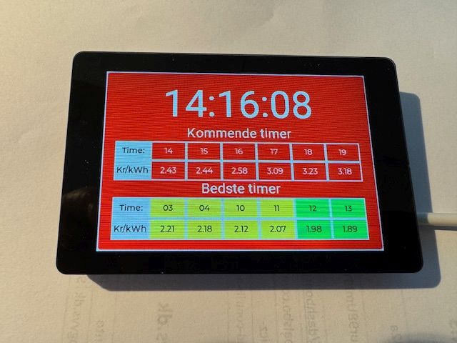

# Electricity Prices for ESPHome

This is just another way to implement 'Electricity Prices' for the Northern Market in HomeAssistant using ESPHome.

This implementation uses a TW32 SC01 Plus to display Time along with the next 6 hour electricity price and the best next 6 hours.

The screen is colored according to the price:

- Blue: very cheap
- Green cheap
- Yellow: medium price
- Red: expensive
- Purple: very expensive.

## Installation:
Copy the contents of the 'components' folder to your HomeAssistant folder: esphome/components

Copy the 'fonts' folder and the 'elpriser.yaml' file to your HomeAssistant folder: components.

Install on a TW32 SC01 Plus device.

The 'NextSix' and 'BestSix' entities have a JSON string with a table of the next and best six houses. The string looks like this:

[{"month": 6, "day" : 20, "hour": 11, "price": 1.345},{"month": 6, "day" : 20, "hour": 12, "price": 1.345},{"month": 6, "day" :hour" :hour": 2 1.345},{"month": 6, "day" : 20, "hour": 14, "price": 1.345},{"month": 6, "day": 20, "hour": 15, "price": 1.345},{"month": "t": 6, " "price": 1.345}]

